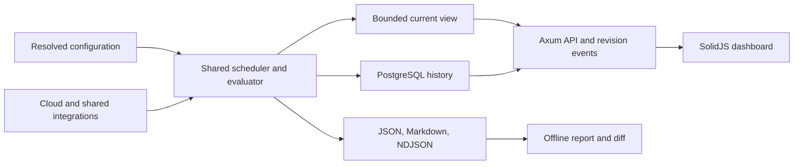

# Healthcheck Monitor

A read-only infrastructure health monitor in Rust, built at Soundpatrol. Run a focused assessment from the terminal, monitor continuously, or serve a live web dashboard. All three modes use the same collection and evaluation engine.

The monitor keeps **system health**, **collection coverage**, and **evidence freshness** separate. A successful API request does not establish health; unavailable telemetry does not mean an outage has recovered. Reports describe their selected scope.

## Capabilities

- **Cloud and Kubernetes checks:** Inventory, workload state, managed dependencies, metrics, queues, alerts, SLOs, backup/recovery metadata, and provider health across GCP, AWS, Azure, and Kubernetes.
- **Shared dependencies:** DNS, trusted TLS and expiry, HTTP status and latency, NATS/KEDA aggregates, GitHub workflows, release provenance, and bounded redacted diagnostics.
- **Configurable execution:** TOML profiles, target/check/resource selection, sampling, per-check schedules, thresholds, grace periods, finite limits, and atomic SIGHUP reload.
- **Persistent dashboard:** Axum, SolidJS 2 RC, Solid router, and Vite; paginated findings and resources, evidence details, transition history, live updates, persistent top bars, and light/dark/system themes.
- **Evidence and history:** Atomic JSON snapshots, Markdown reports, rotated NDJSON transitions, offline comparisons, and PostgreSQL dashboard history with native UUIDv7 keys.
- **Monitoring queries:** Seven days of diagnostic history, scoped JSON APIs and OpenAPI, and an MCP connector for Codex CLI and Claude Code using individual Google sign-in through IAP.
- **Bounded operation:** Fair scheduling, independent provider scopes, reused clients and observations, batched metrics, bounded caches, response limits, and cancellation deadlines.

Collection does not change infrastructure, consume queue messages, read application database records or secret values, perform synthetic transactions, or send notifications. Endpoint probes do not retain response bodies. PostgreSQL writes belong only to the monitor's own history store.

## Quick start

Requirements: current stable Rust, a C compiler for jemalloc, Node 24 or newer with npm to build the embedded dashboard, and credentials for your selected targets. The project uses edition 2024 and the prebuilt Rust standard library. Linux and macOS are supported.

```sh
git clone https://github.com/snowcrash-labs/healthcheck-monitor.git
cd healthcheck-monitor
npm --prefix dashboard ci
npm --prefix dashboard run build
cargo build --locked -p healthcheck-monitor
cp monitor.example.toml monitor.local.toml
```

Edit `monitor.local.toml` with your Kubernetes context, endpoints, and cloud targets before collecting. It is ignored by Git. The checked-in `monitor.toml` is Soundpatrol's deployment configuration; the generic example is the starting point for another environment.

```sh
target/debug/healthcheck-monitor config validate --config monitor.local.toml --show-effective
target/debug/healthcheck-monitor run --config monitor.local.toml --profile quick
```

An individual scan failure does not stop independent checks. The command publishes the available evidence before choosing its exit status.

## Execution modes

| Command | Behavior |
| --- | --- |
| `run` | Collect and evaluate an assessment, publish evidence, then exit. |
| `watch` | Schedule checks autonomously until stopped or `--duration` expires. |
| `serve` | Run the same autonomous monitor with an HTTP API and dashboard. |
| `report <snapshot>` | Render an existing JSON snapshot offline. |
| `diff <older> <newer>` | Compare snapshots offline. |
| `config validate --show-effective` | Validate and print resolved settings without credentials. |
| `auth status` | Check configured identities and credential availability. |
| `auth login <profile>` | Explicitly launch the selected authentication helper. |

```sh
# Focus on Kubernetes; required collection prerequisites are included automatically.
target/debug/healthcheck-monitor run --config monitor.local.toml \
  --target cluster --check kubernetes --output evidence/cluster

# One queue observation leaves persistence-dependent conclusions unevaluated.
target/debug/healthcheck-monitor run --config monitor.local.toml \
  --target cluster --check queues --samples 1 --output evidence/queues

# Override every selected check's cadence for this invocation.
target/debug/healthcheck-monitor watch --config monitor.local.toml \
  --profile full --interval 60s --duration 30m --output evidence/watch

target/debug/healthcheck-monitor report evidence/cluster/monitor-latest.json
target/debug/healthcheck-monitor diff older-snapshot.json newer-snapshot.json
```

`--target`, `--check`, and `--resource` support focused diagnostics. Queue assessments use five observations, thirty seconds apart, by default. Use separate output directories for concurrent processes because each evidence store has a single-writer lock.

## Dashboard

The dashboard needs a dedicated PostgreSQL 18.6 or newer database. Vite runs only during the build. `rust-embed` incorporates the frontend and its precompressed gzip/zstd representations at compile time, including development builds. Axum serves borrowed embedded bytes from the same listener as the API; the executable needs no asset directory or Node runtime. The CLI's `run`, `watch`, `report`, and `diff` commands do not require PostgreSQL.

```sh
npm --prefix dashboard ci
npm --prefix dashboard run build
cargo build --locked -p healthcheck-monitor
```

Create a database owned by the monitoring service role, then provide its connection URL. Embedded migrations initialize the `health_monitor` schema at startup. Adjust the example URL for your PostgreSQL user, authentication method, and host.

```sh
env HEALTHCHECK_DATABASE_URL='postgresql://localhost/healthcheck_monitor_dashboard_dev' \
  target/debug/healthcheck-monitor serve --config monitor.local.toml \
  --server-config server.example.toml --profile quick --output evidence/dashboard
```

Open **http://127.0.0.1:9840**. Checks run without connected browsers. Refreshes read current state; they do not launch scans. Target selection survives navigation, and theme preference persists locally. Styling is centralized in [styles.css](dashboard/src/styles.css).

If the monitor runs on another machine over SSH, forward its loopback port from your computer:

```sh
ssh -N -L 9840:127.0.0.1:9840 your-monitor-host
```

The default listener is loopback-only. Configure TLS in `server.local.toml` to prefer HTTP/2 through ALPN. Shared access supports Google IAP with verified ES256 assertions, issuer, backend audience, expiry and identity domain, or an explicitly trusted authentication proxy. Authentication protects API routes and embedded assets. See the [dashboard runbook](docs/plans/2026-09-05-dashboard-operations.md) for TLS, access controls, database permissions, retention, and foreground supervision.

For a terminal-only build without Node or dashboard assets, use `cargo build --locked -p healthcheck-monitor --no-default-features`. This omits `serve` while retaining one-off assessments and continuous command-line monitoring.

For frontend development, run the loopback service and `npm --prefix dashboard run dev`. Vite serves the application on port 5173 and proxies API requests to port 9840.

## Configuration and credentials

To query an existing continuous monitor, install `healthcheck-connect` and follow the [query access runbook](docs/plans/2026-09-06-monitoring-query-operations.md). The connector needs no local collectors or provider credentials. It supports time ranges, cloud scopes, monitoring categories, resources, redacted logs, and post-deployment assessments as short as one minute. These queries read collected evidence; they do not start scans.

Settings resolve in this order: built-in defaults, global configuration, selected profile, target settings, check settings, and explicit CLI overrides. Detailed monitoring runs only against configured targets; organization discovery does not silently expand that scope.

| Profile | Default behavior |
| --- | --- |
| `quick` | Preflight, endpoints, Kubernetes state, and one queue observation. |
| `full` | All applicable configured domains; the default profile. |
| `deep` | Full coverage with a 24-hour, 5,000-entry log window and bounded diagnostics. |

Profiles are editable presets. Capacity defaults are 80% warning and 90% error sustained for ten minutes where a valid denominator exists. Business-specific latency, queue age, recovery objectives, and SLO thresholds require configuration. Intervals, retries, timeouts, concurrency, freshness, retention, and confirmation counts are adjustable.

| Integration | Credential source |
| --- | --- |
| GCP | Native `google-cloud-auth` with Application Default Credentials or a configured credential file. Local ADC uses `gcloud auth application-default login`; ordinary `gcloud auth login` is separate. |
| AWS | Official `aws-config` and service SDKs; shared profiles, IAM Identity Center sessions, role assumption, environment credentials, or workload credentials. Interactive SSO login uses `aws sso login`. |
| Azure | `azure_identity`; the existing `az login` session through `AzureCliCredential`, or configured managed/workload identity. |
| Kubernetes | The selected kubeconfig context and supported credential plugin. GKE commonly uses `gke-gcloud-auth-plugin`. |
| GitHub | A configured protected `credential_file`, or the token environment variable (default `GH_TOKEN`) with `gh auth token` fallback. A file and token variable cannot be configured together. |

Collection never initiates interactive login. Providers reuse and refresh credentials where supported; expired credentials leave dependent checks incomplete while independent checks continue. Tokens are excluded from snapshots, database history, frontend assets, and diagnostic logs.

SIGHUP reloads monitoring configuration in `watch` or `serve`. Invalid replacements retain the previous configuration. Listener, TLS, access, database, and asset settings require a restart.

## Health and failure semantics

Health states are `healthy`, `degraded`, `unhealthy`, `unknown`, and `expected_inactive`. Findings retain stable resource/rule identities, original observation times, expected state, confidence, and evidence references. Fresh evidence is required for recovery; stale, failed, or truncated collection cannot establish recovery or resource removal.

Configured endpoint paths require exact accepted statuses. Kubernetes Job terminal conditions take precedence over failed attempt counters. Restart comparisons require the same pod UID and container. Grace periods, suspended schedules, intentional scale-to-zero, and dormant resources remain explicit expectations.

| `run` exit code | Meaning |
| --- | --- |
| `0` | No error-level findings or incomplete required coverage in the selected scope. |
| `1` | Health errors; `--strict` also includes warnings. |
| `2` | Fatal configuration or output failure. |
| `3` | Incomplete required coverage, including combined coverage and health failures. |
| `130` | User cancellation after attempting partial publication. |

`watch` and `serve` continue through individual failures and unhealthy resources. Duration expiry is normal completion; the final report retains health and coverage. Shutdown allows five seconds to finalize partial evidence and clean up outstanding work.

Disk and PostgreSQL faults remain visible while collection continues. Database admission is bounded; dropped records become explicit gaps when storage recovers. Pending database history can be lost if an outage lasts through shutdown. The journal is not a durable message spool.

## Coverage and architecture

| Domain | Representative coverage |
| --- | --- |
| GCP | GKE, Compute, Cloud Run, SQL, Redis/Valkey, Pub/Sub, Eventarc, Scheduler, builds, storage, DNS, keys/secrets metadata, Monitoring metrics/alerts/SLOs, quotas, and service health. |
| AWS | EC2/Auto Scaling/EBS, EKS/ECS/Lambda, load balancing, Route 53/CloudFront/ACM, RDS/ElastiCache/DynamoDB, S3, queues/events, registries/builds, backups, keys/secrets metadata, CloudWatch, quotas, and AWS Health. |
| Azure | Resource Graph, VM/VMSS/disks, AKS, Container Apps/App Service/Functions, load balancing/DNS/network metadata, databases/cache/storage, messaging, registries, Key Vault metadata, backups, Monitor, quotas, and Resource/Service Health. |
| Shared | Kubernetes controllers, pods, jobs and schedules, HPA/KEDA, warning events, routes, certificates, ExternalSecrets, NATS aggregates, endpoints, GitHub, provenance, and redacted diagnostics. |

AWS collection uses official Rust SDK clients over a bounded transport. GCP and Azure management reads use bounded typed REST adapters with native credential providers. Kubernetes uses `kube`; other shared integrations use native clients where applicable. A configured NATS fallback runs fixed aggregate reports through an existing utility deployment. Unsupported services, denied APIs, missing metrics, and unavailable entitlements remain explicit coverage outcomes.



The workspace separates [core evaluation](crates/core), [provider adapters](crates/providers), [shared integrations](crates/integrations), [runtime supervision](crates/runtime), [history](crates/history), [HTTP serving](crates/server), and the [CLI](crates/cli). Clients and observations are reused across checks; independent reads run concurrently within global and provider-scope limits.

## Development and verification

```sh
cargo fmt --all --check
cargo clippy --locked --workspace --all-targets -- -D warnings
cargo test --locked --workspace
cargo audit
npm --prefix dashboard run check
npm --prefix dashboard test
npm --prefix dashboard run build
npm --prefix dashboard audit
```

PostgreSQL contract tests require an isolated database named `healthcheck_monitor_dashboard_test`. Browser tests require a running dashboard with at least one observed resource and Playwright Chromium. Commands are in the [dashboard runbook](docs/plans/2026-09-05-dashboard-operations.md). Dependency maintenance uses `cargo upgrade --incompatible` and committed Rust/npm lockfiles.

The [development workflow passed Linux/macOS checks and PostgreSQL contract tests](https://github.com/snowcrash-labs/healthcheck-monitor/actions/runs/34106090813). Live Google IAP verification also covered credential refresh over SSH, all seven MCP tools, diagnostic pagination, and a one-minute deployment assessment. See [query verification and remaining work](docs/plans/2026-09-06-monitoring-query-access.md#verification) for the explicit assessment-page-size limitation and observed coverage gaps. Earlier engine and dashboard verification, including Linux ARM64 and browser scenarios, is recorded in the documents below. Provider credentials, telemetry mappings, and production load remain deployment-specific validation work.

## Documentation

- [Monitoring configuration, permissions, and operation](docs/plans/2026-09-05-monitor-operations.md)
- [Dashboard setup, access controls, and history](docs/plans/2026-09-05-dashboard-operations.md)
- [Google login, SSH setup, MCP/API queries, and known limitations](docs/plans/2026-09-06-monitoring-query-operations.md)
- [Query design, live verification, and remaining work](docs/plans/2026-09-06-monitoring-query-access.md)
- [Backend design](docs/architecture/be/design.md) and [frontend conventions](docs/design/fe/dashboard.md)
- [Monitoring verification](docs/plans/2026-09-05-monitor-verification.md) and [dashboard verification](docs/plans/2026-09-05-persistent-dashboard.md)
- [Collection optimization and concurrency measurements](docs/plans/2026-09-05-collection-optimization.md)
- [Rust/Python benchmark and measurement limits](docs/plans/2026-09-05-release-python-benchmark.md)
