# Monitoring design

The CLI resolves a versioned configuration into a finite set of target/check registrations. The same scheduler drives one-off sampling and continuous checks. It admits work by provider scope, coalesces missed ticks, prevents overlapping checks, and records each configuration revision. Native async implementations use generic dispatch and explicit Send bounds.

```mermaid
flowchart LR
    Config[Validated configuration] --> Scheduler[Bounded scheduler]
    Scheduler --> Native[Native credentials and clients]
    Native --> Transport[Bounded read requests]
    Transport --> Projection[Allowlisted metadata projection]
    Projection --> Cache[Shared normalized inventory]
    Cache --> Policy[Health and progress evaluation]
    Policy --> State[Current state and confirmed transitions]
    State --> Store[Atomic snapshots and bounded history]
    Store --> Offline[Offline reports and comparisons]
```

Shared target clients use an `scc::HashMap`. Normalized inventory entries use an `scc::HashCache`, per-entry async locks, monotonic expiry, and a shared byte budget. Concurrent requests for the same inventory reuse one collection and preserve original observation timestamps. Cache admission failure causes a fresh read instead of blocking collection. Evidence and comparison maps have a single owner and deterministic serialization.

The HTTP boundary permits GET/HEAD metadata reads and a closed set of documented read-only POST operations. AWS SDK requests use a bounded transport; the operation policy supports the current CloudWatch RPC/CBOR paths as well as the configured REST/Query adapters. Credential acquisition has separate, narrow exceptions for STS and local workload metadata. Endpoint probes discard response bodies. Provider payloads are projected before entering evidence or the inventory cache.

Health and collection coverage remain separate. Policies evaluate known observations, and lifecycle rules require fresh evidence for recovery and separate successful inventories for removal. Missing worker observations are not converted to zero replicas. Job completion takes precedence over failed attempts. Pod restart comparisons require the same UID and container. Warning Events and pod-local hostnames do not become application outages or public endpoint targets.

Progress checks consume configured aggregate demand and completion signals. Each stage retains a bounded counter/rate watermark and observation continuity. Ready workloads with sustained demand and no completions can be stalled. Idle input is expected inactivity; missing telemetry, counter resets, and observation gaps remain unknown. No database records or synthetic transactions are used to manufacture progress evidence.

Snapshots retain observation ages, selectors, health states, active findings, bounded retirement history, and comparison state. The latest JSON file is the publication marker. Owner-only temporary files are synced before rename, and retention reserves space for publication and recognizes only service-owned filenames. Persistence errors remain visible while watch collection continues.

## Operational boundaries

`monitor.toml` contains explicit deep-monitoring targets. Organization/account/subscription discovery does not expand those targets. Authentication refresh is native where supported; collection never starts browser login. The explicit login command delegates to the corresponding provider helper.

Run the binary in the foreground under an existing Linux or macOS supervisor. Send SIGHUP to reload the same config path, SIGTERM or SIGINT to stop, or use `--duration` for a bounded watch. Use a dedicated output directory for each running writer; one-off diagnostics can use a separate `--output` directory while continuous monitoring is active.

Linux and macOS development checks are defined in the repository workflow. Local verification currently runs on macOS; there is no Linux container runtime available in this workspace. No release builds or deployment changes are part of these checks.

## References

- [Requirements, coverage, and acceptance](../../plans/2026-09-04-configurable-health-monitor.md).
- [Stable async traits and dynamic-dispatch constraints](https://doc.rust-lang.org/reference/items/traits.html#dyn-compatibility).
- [AWS SDK HTTP connector contract](https://docs.rs/aws-smithy-runtime-api/latest/aws_smithy_runtime_api/client/http/trait.HttpConnector.html).

