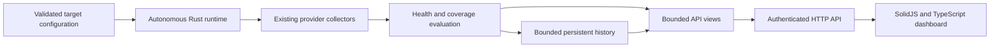

# Persistent health service and dashboard assessment

Status: historical feasibility assessment from before the dashboard implementation. Its effort ranges and descriptions of missing runtime/API features are not estimates of remaining work. See the [implementation record](2026-09-05-persistent-dashboard.md), [current access and operations](2026-09-06-monitoring-query-operations.md), and [next dashboard, cloud, and cost plan](2026-09-07-dashboard-structure-clouds-and-costs.md).

A persistent internal health dashboard is a moderate extension of the current implementation. Continuous scheduling already works without a browser or operator triggering each check. The product would make Soundpatrol's operational checklist continuously visible: what is unhealthy, what changed, whether work is progressing, and where evidence is missing. Replacing a general observability platform requires substantially more than presenting these findings in a frontend.

This is an assessment, not a deployment specification. Estimates assume one experienced Rust/TypeScript engineer, one internal organization, modest dashboard traffic, and access to an existing hosting environment and SSO. They are cumulative planning ranges, not commitments; unresolved provider access or new application instrumentation can extend them.

| Deliverable | Estimated elapsed effort | Scope |
|---|---|---|
| Local dashboard prototype | 2-4 working days | Existing watch engine, read-only API, target overview, findings and evidence details; current file history. |
| Useful internal service | 2-4 weeks | Shared runtime, authenticated dashboard, unattended credentials for selected targets, live updates, queryable finding history, supervision, integration and browser tests. |
| Operational hardening | 4-8 weeks | Extended live validation, bounded history and optional trend storage, monitor health, recovery drills, capacity measurements, backup/restore, and a scoped notification lifecycle if required. |
| Broad Datadog parity | Separate platform project | Telemetry ingestion, arbitrary queries, distributed tracing, profiling, browser instrumentation, and extensive operational integrations are outside these estimates. |

The strongest reusable boundaries are [the scheduler](../../crates/core/src/scheduler.rs), [health state](../../crates/core/src/state.rs), [evidence model](../../crates/core/src/model.rs), provider adapters, and bounded publication. The [CLI runtime](../../crates/cli/src/runtime.rs) currently owns process signals, state updates, configuration reload, and persistence. Extract that orchestration into a reusable runtime rather than starting a CLI subprocess from an HTTP request. Both `watch` and a proposed `serve` command would drive the same engine.

Start with one active collector process serving the API and compiled frontend assets. Monitoring must continue with no connected browsers, and slow clients must never block collection. Publish bounded read views after completed evaluations; paginate resources and findings rather than cloning or transmitting the full evidence state for each request. Server-sent events can announce revision changes, with bounded per-client buffers and a full refresh after reconnect or an event gap. Static asset serving and API reads should remain separate from scheduling. A future "run now" operation must enter the existing bounded scheduler with deduplication and authorization; it must not launch an independent scan per click.

The first frontend should have three main views: an environment overview; a findings list with resource, severity, evidence, age and recovery history; and a resource view containing relevant workload, queue, endpoint and release facts. Explain rule identifiers in plain language. Show health, coverage and freshness separately. Missing credentials, unavailable metrics, and disconnected collection must remain visible even when there are no active health errors. Preserve expected scale-to-zero and suspended workloads. An overview only describes configured and observed scope, not the entire organization by implication.

Current JSON snapshots and NDJSON transitions can support a prototype. They retain compact state under a default 24-hour bound and are published every five minutes; the live UI should read newly evaluated in-memory state rather than wait for publication. They are not an indexed time-series database. Historical incident queries need persisted finding details as well as transition IDs, so removed resources remain understandable after the current snapshot changes. A team service can add PostgreSQL for normalized findings, transitions, run summaries and configuration revisions, with migrations, indexes and explicit retention. Keep evidence exports as artifacts. If metric trend charts are required, persist selected series with their source timestamps, units, aggregation windows, continuity and downsampling; full snapshots every few seconds would be wasteful and could misrepresent overlapping metric windows.

Unattended operation needs dedicated read identities, credential refresh, reachable cloud and Kubernetes endpoints, persistent storage and a supervisor. Personal browser sessions should not be the production credential strategy. Kubernetes exec plugins and the existing NATS utility fallback are deployment dependencies until configured alternatives replace them. Reuse an existing SSO boundary initially, keep provider credentials exclusively on the server, and keep configuration file-managed for the first version. Editable rules, acknowledgements, maintenance windows and immediate checks introduce authorization and audit requirements beyond a read-only viewer.

Use one active scheduler initially. The existing file lock prevents duplicate local writers, but does not coordinate collectors across separate hosts or disks. Replicas require leader election or explicit target partitioning before they can safely share a schedule. Monitor the scheduler heartbeat, oldest overdue check, queue depth, collection failures, credential health, persistence failures and dropped transitions. An independent uptime or heartbeat check must detect failure of the monitor itself. A dashboard hosted only inside a monitored cluster can disappear with that cluster; its placement and the independent check need separate failure domains.

Findings and transitions are not yet an incident notification service. Adding one requires a durable delivery queue, retry and deduplication, routing, silence and maintenance semantics, recovery notifications, and explicit handling of incomplete evidence. Notification design and implementation would be separate scope; this assessment does not send messages or enable delivery. Infrastructure remediation and synthetic transactions remain excluded.

The existing verification is a useful starting point, not evidence of prolonged unattended production operation. The [verification record](2026-09-05-monitor-verification.md) documents missing GCP ADC, applicable AWS/Azure credentials, direct NATS TLS validation, production RSS measurements, and deployment-specific aggregate progress mappings. The dashboard cannot fill those data gaps. Before serving as primary monitoring for selected targets, validate credentials and required telemetry there, exercise expired credentials and restart recovery, run a sustained live soak, measure API load and storage growth, and verify that stalled collection cannot leave an apparently current green screen. Add API redaction, authorization, pagination, reconnect, browser rendering, notification lifecycle if included, and collector/API independence tests. The recently reviewed transport reuse and per-check connection-setting issues should be included in hardening.

For the operational checklist, the bespoke service could replace dashboarding and rule evaluation that would otherwise be configured in Datadog. It can express domain-specific rules such as intentional KEDA inactivity, queue demand without worker progress, and desired versus deployed revisions. It still depends on cloud monitoring and logging APIs for much of its evidence; provider charges, API quotas and telemetry retention remain. Engineering maintenance, access management and operating the monitor replace part of a hosted product's cost, so no savings estimate is justified without measured usage and ownership costs.

Datadog also provides [distributed tracing and application performance investigation](https://docs.datadoghq.com/tracing/), [log search and analytics](https://docs.datadoghq.com/logs/explorer/), and [real user monitoring and session replay](https://docs.datadoghq.com/real_user_monitoring/). The current monitor stores redacted diagnostic signatures and selected aggregates, so these capabilities cannot be recovered merely by adding charts. Keep existing provider consoles or a telemetry backend for those investigations. Any replacement decision should inventory the monitoring capabilities actually in use and compare detection and investigation outcomes for an agreed overlap period.

The recommended first scope is a read-only internal console over the existing watch engine, with SSO, dedicated identities, current findings, evidence freshness, incident history and the monitor's own health. Add trends and incident delivery only where the operational workflow needs them. This gives the team a persistent health dashboard while keeping the implementation focused on the rules it already evaluates.
