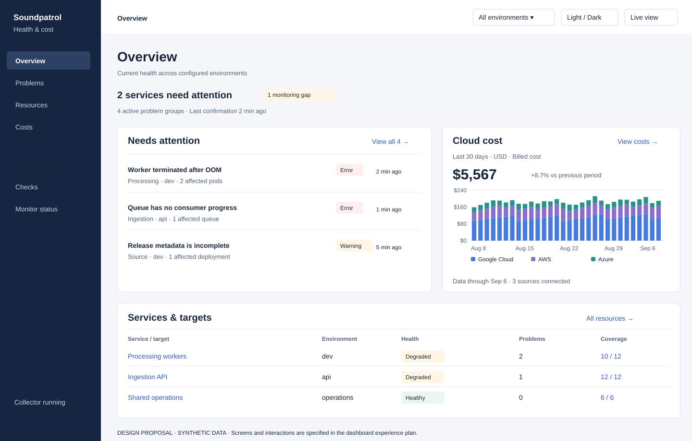
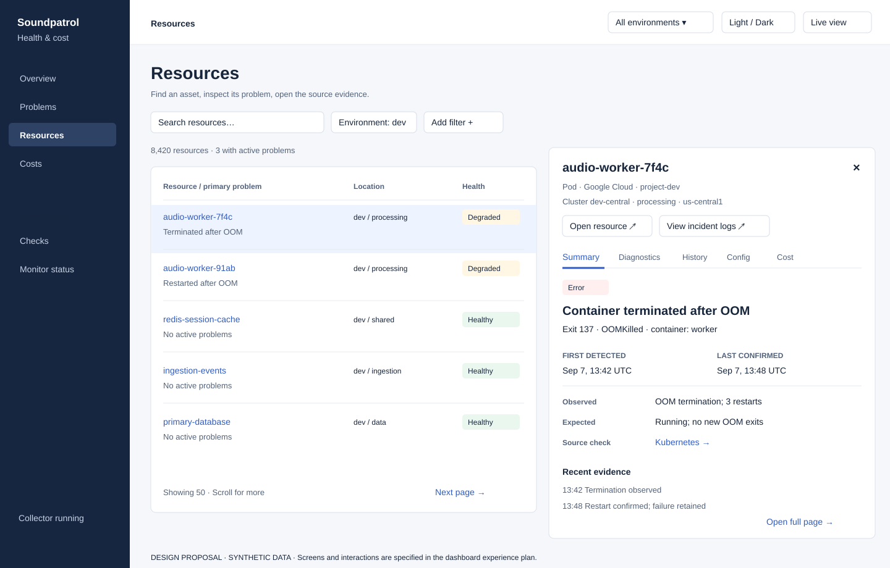
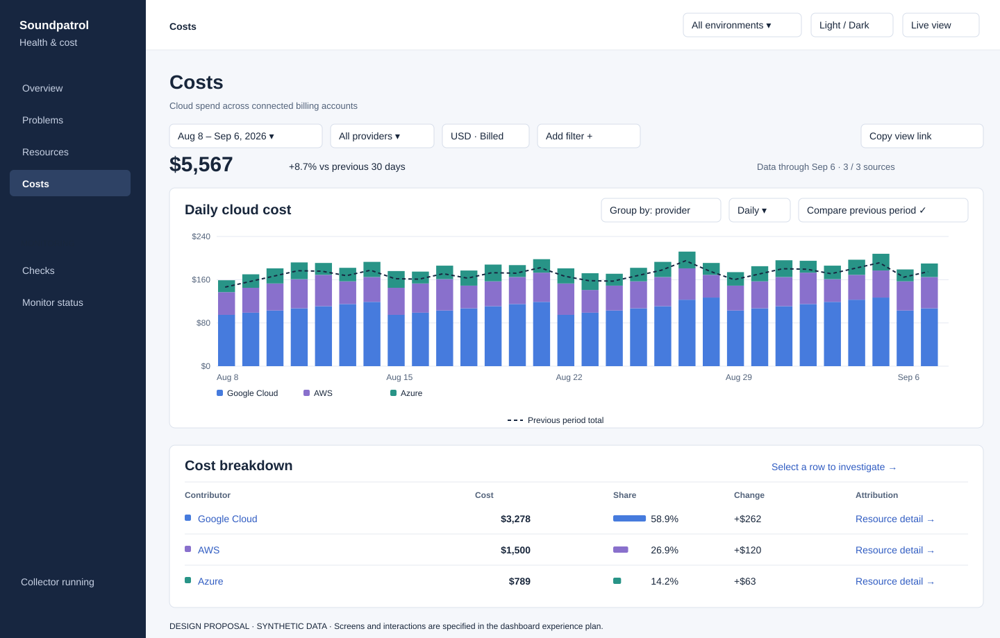

# Dashboard experience overhaul

Status: implementation reference, reviewed on 2026-09-07. The redesigned UI and GCP billing are deployed; remaining source and production acceptance are tracked in the [billing runbook](2026-09-07-dashboard-billing-operations.md). This defines the visible outcome required by the [implementation plan](2026-09-07-dashboard-structure-clouds-and-costs.md). The illustrations use synthetic data and do not represent the running application or actual Soundpatrol costs. The proposals remain design references.

The deliverable is a redesigned operational dashboard with interactive billing charts. An administrator should identify an affected service, understand the failure, open the relevant evidence, and investigate spending without reading a collection report. Replace the current page composition and interactions across Overview, Problems, Resources, resource detail, Checks, and Costs. Keep the persistent header, Solid Router, centralized styles, strict types, light/dark/system themes, and embedded single-binary delivery.

## Competitor review

Reviewed official documentation and Datadog's published screenshots. This is a workflow and screen-structure comparison, not a hands-on assessment of authenticated competitor accounts.

| Reference | Observed pattern | Required application here |
| --- | --- | --- |
| [Datadog Cost Explorer](https://docs.datadoghq.com/cloud_cost_management/reporting/explorer/) and its [published screen](https://docs.dd-static.net/images/cloud_cost/reporting/reporting-overview-1.4b1d07d9aa75243178be50c98416095f.png) | Scoped time-series graph above a ranked cost table; grouping, comparison, and drilldown controls. | Prominent spend chart on Overview and a full Costs explorer. Chart, table, filters, and comparison must describe the same selection. |
| [Datadog cost-change panel](https://docs.datadoghq.com/cloud_cost_management/reporting/explorer/#cost-change-summary-side-panel) | A table row opens cost/change context and further breakdown while the explorer remains visible. | Selecting a contributor exposes its trend, amount, comparison, and attributable resources without losing the original investigation. Claim usage/price causes only when supporting data exists. |
| [Datadog Resource Catalog](https://docs.datadoghq.com/infrastructure/resource_catalog/) and its [published detail panel](https://docs.dd-static.net/images/infrastructure/resource_catalog/resource_catalog_sidepanel_2.0c2044622b9a11946017f2c00077449c.png) | Resource list beside a detail panel; identity once at the top, related information in sections, cloud-console action in the header. | Compact inventory with a URL-addressable preview. One resource identity, relevant failure evidence, and clearly labeled resource/log destinations. |
| [Datadog monitor search](https://docs.datadoghq.com/monitors/manage/search/) | Search, facets, status selection, and saved views narrow a large monitor list. | Searchable compact Checks table with attention/complete/waiting filters. Use ordinary text and visible controls; no query-language knowledge required. Rule editing, muting, and manual resolution remain outside the read-only product. |
| [Grafana Metrics Drilldown](https://grafana.com/docs/grafana/latest/visualizations/simplified-exploration/metrics/drill-down-metrics/) | Filters and time precede investigation; detail connects related evidence and preserves exploration state in URLs. | Retain scope and time from problem to resource to diagnostics; copyable investigation URLs. Preserve the explicit current-versus-historical distinction. |
| [New Relic Hosts](https://docs.newrelic.com/docs/infrastructure/infrastructure-data/infrastructure-ui-pages/infra-hosts-ui-page/) | Service context can carry into filtered infrastructure; charts, tables, details, and saved views work together. | Target/service navigation leads directly to affected resources. Reuse filters and selected columns across detail/back navigation. Its documented time picker does not filter every table; our UI must label such differences explicitly. |

Adopt these investigation patterns with fewer visible controls. Datadog's broad query builder and large product navigation are unnecessary for the default screen. New Relic's older Inventory filter sets are being deprecated according to its [Inventory documentation](https://docs.newrelic.com/docs/infrastructure/infrastructure-data/infrastructure-ui-pages/infra-inventory-ui-page/); use URLs and browser bookmarks initially, rather than reproducing that feature or adding shared saved-view administration.

## Coverage of the requested changes

| Request | Concrete deliverable | Done when |
| --- | --- | --- |
| Visual billing chart across services | Overview spend chart plus full Costs explorer, daily/monthly trends, contributor breakdown, change comparison, and resource drilldown. | Real imported costs render and reconcile; selecting a date/series filters the table. Missing sources are explicit. A number-only card or placeholder does not pass. |
| UX overhaul; current screens are unreadable | Replace card-heavy summaries with a clear page hierarchy, aligned rows, readable type, and details on demand. | A new reader can identify scope and the main problem in ten seconds, then reach evidence within two navigation steps. |
| Human-readable check failures | Check name, collection state, one recorded reason, target, and age in a table. | No `TruncatedRequired` or `Inventory_onlyOptional`; operation mechanics appear only in details. |
| Clickable target panels | Target/service rows navigate to scoped overview and affected resources. | Mouse, keyboard, direct links, and browser back all preserve scope. |
| What, when, where for errors | Problem title, affected identity, first/last confirmation, observed versus expected values, source, and incident timeline. | A failure is understandable without reading raw IDs or opening several unrelated pages. Unknown fields say Not recorded. |
| Working GCP/AWS/Azure links | Separate Open resource, View incident logs, and native alert/build actions. | Authenticated click-through reaches the intended configured resource and time window; fallback actions are accurately labeled. |
| Show what the checks actually are | Dedicated Checks route, count links, descriptions and operation details. | Every configured check is reachable, including those waiting for their first run. |
| Search, endless scroll, and no view cutoff | Server search and bidirectional pagination with bounded DOM retention. | All retained matches remain reachable; total count is independent of the visible page. |
| Flicker and lost context | Stable row reconciliation, coalesced refresh, preserved panel/tab/focus/scroll. | A 60-second changing-data/reconnect test does not blank the page or move the selected row. |
| AWS/Azure resources | The same resource/problem/check screens accept all provider identities and location fields. | Configured families have operational observations and evaluation, not just inventory. Live rollout follows the separate coverage checklist. |
| Persistent bars, themes, centralized styling | Shared application shell and typography/spacing/status/chart tokens. | All screens, panels, and charts work in both themes, with keyboard navigation and narrow layouts. |

## Overview



At 1440 by 900 CSS pixels, show the scope/title, a short operational summary, the first problem rows, and the actual billing graph without scrolling. Put Problems and Cloud cost alongside one another; on narrower screens stack Problems, Cloud cost, then Services. The chart stays a first-class panel rather than being buried after the full check catalog. Keep health state and monitoring gaps distinct, but give each one concise placement.

Use three to five highest-priority problem groups with affected-resource counts and View all. Grouping does not assert root cause. A service/target row shows human name, environment, health, problem count, and coverage. Clicking it opens that scope. Move check descriptions, retry/page counts, database health, and repeated explanatory footers into Checks or Monitor status. A material history or access gap gets one concise notice where it changes the conclusion.

## Problems, Resources, and investigation



Problems defaults to Active with Recent errors and Changes tabs. Its columns are Problem, Resource/service, Environment/location, Severity, First detected, and Last confirmed. Resources uses Name/type, Location, Health, Primary problem, and Last confirmed. Show one optional evidence line per row; multiple paragraphs, repeated facts, and several console buttons do not belong in every row. Keep numeric columns aligned and the most distinguishing part of a long name visible; full identity is copyable in the panel.

Use one search/filter toolbar with visible active chips and a clear reset. Put less common dimensions in Add filter. Resource row selection opens a desktop side panel with a close button, preserves list position, and changes the URL. Provide a real resource-name link for opening a full page or new tab. On narrow screens use the full detail route instead of squeezing both panes. Escape closes a modal panel and restores focus to its originating row; full pages retain normal back behavior.

The detail header contains human name, type, provider scope, location, and Open resource/View incident logs. Summary leads with the selected failure: what happened, when it began, last confirmation, observed value versus expected state, and the source check. Diagnostics shows grouped redacted errors and sample windows; History shows known changes and gaps; Configuration shows allowlisted metadata; Cost shows attributable spend or an explicit attribution gap. Do not repeat the identity block in each finding. A small status timeline is appropriate when retained transitions support it; gaps stay gaps, and no performance sparkline is invented from a single observation.

## Checks

Replace the card grid with an attention-first table: Check, Target, Collection, Main issue, Last run, Schedule. Example:

```text
Releases     dev     Partial      Build results incomplete     5 min ago     Every 5 min
Endpoints    api     Collected    No collection failures       20 sec ago    Every 30 sec
```

Collected describes evidence collection. Health findings appear separately in the detail view. Clicking Releases explains its purpose once, shows incomplete operations first, and provides tabs for All operations and Run history. Where a cutoff was not recorded, say so; do not invent how many records were missed. The overview's coverage count links directly to this list with the relevant target/filter.

## Billing chart and explorer



The default overview chart shows 30 days of daily billed cost by provider, with a visible currency, period total, previous-period difference, data-through status, labeled axes, and a short legend. Costs expands that same chart and adds daily/monthly granularity, grouping by provider/product/application service/environment, native billing scope, and charge category. Show advanced accounting controls under Options; keep the selected measure visible beside the currency.

| Interaction | Required behavior |
| --- | --- |
| Hover or keyboard focus on a day | Tooltip gives the exact date, each contributor, total, currency, and completeness. Touch selects the same information. |
| Select a bar/segment | Add date and contributor chips; update the ranked table and selected total. An explicit clear action restores the previous range. |
| Select a legend item | Filter to that contributor using the same visible chip semantics. Stable colors and text labels remain consistent across chart and table. |
| Change grouping | Recompute chart and table together; the total for the same scope, period, and measure stays unchanged. |
| Compare previous period | Show a distinguishable dashed previous-total line and absolute/percentage differences where comparable. The baseline is labeled and never added to the stacked total. |
| Open a breakdown row | Show contributor trend, prior-period change, attribution, and affected resources in a panel or scoped detail route; back restores the chart selection. |
| Many contributors | Plot the largest contributors plus Other; its complete breakdown remains searchable and pageable. Table columns are Contributor, Cost, Share, Change, and Attribution. |
| Missing or partial source | Use a gap or patterned provisional region and one concise source notice. Never substitute zero or synthetic values. Authorized users can inspect source completeness. |
| Negative adjustments | Draw below zero and include them once in the total. Explain net totals; do not use a pie chart or percentages when negative values make shares misleading. |
| Keyboard, zoom, or small screen | Provide an accessible table equivalent, visible focus, readable labels, and an explicit date selection alternative to pointing at a narrow bar. |

Keep chart colors separate from health severity colors, use a clear zero baseline and linear cost scale, and avoid animated redraws during background refresh. The examples show three fictional connected providers; initial production may show GCP only with other billing sources labeled as unconnected. Real GCP billing should ship independently of AWS/Azure onboarding. A chart backed only by fixtures is not completion.

## Readability and acceptance

Centralized tokens should start with 14-16 px data/body text, 12 px minimum supporting labels, 20-24 px page headings, consistent line heights, and 44 px or larger ordinary table rows. These are layout defaults to verify with real content, not permission to clip long text. Use restrained borders, aligned columns, and spacing to separate hierarchy. Reserve badges for state, with text as well as color. Avoid all-caps explanatory paragraphs and repeated introductory copy. Correct normal-text contrast to at least 4.5:1 and validate keyboard focus and 200% zoom against [WCAG 2.2](https://www.w3.org/TR/WCAG22/).

Acceptance exercises use representative healthy, failing, stale, partial, denied, empty, long-name, and high-cardinality fixtures. Two coworkers unfamiliar with the implementation must be able to identify the affected environment/resource, open incident evidence, find what a check does, explain a cost increase by contributor, and return to the previous selection. Record time and navigation steps; revise the layout when either reader has to interpret collector enums or search unrelated pages. Verify Firefox, Chromium, and WebKit, light/dark modes, narrow layouts, and changing data. Production acceptance additionally requires real reconciled billing and authenticated provider-link checks. The backend, security, retention, and failure contracts remain in the implementation plan.
